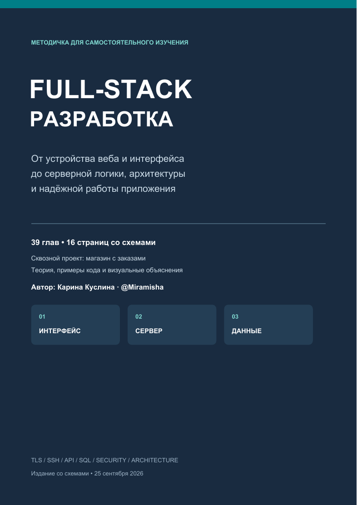
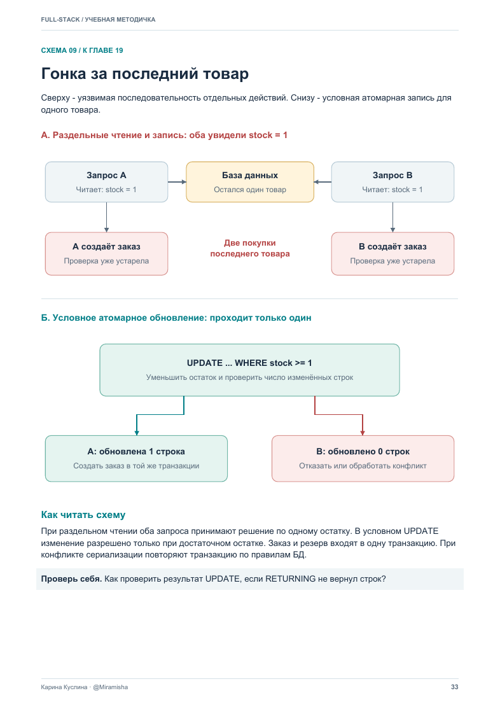

# Full-stack: учебная методичка

**Автор: Карина Куслина · [@Miramisha](https://github.com/Miramisha)**

Русскоязычная методичка для самостоятельного изучения full-stack разработки: **39 глав, 64 страницы и 16 страниц со схемами**. Теория связана сквозным проектом — интернет-магазином с заказами.

**[Открыть PDF](docs/fullstack-handbook.pdf) · [Скачать PDF](https://github.com/Miramisha/fullstack-handbook/raw/refs/heads/main/docs/fullstack-handbook.pdf)**

## Что внутри

- Основы веба, структуры данных и базовая сложность Big O.
- HTML, CSS, JavaScript, TypeScript, компоненты и состояние frontend.
- Сети, HTTP, DNS, TLS, HTTPS и SSH.
- Фреймворки, устройство сервера, API и бизнес-логика.
- SQL, ORM, индексы, транзакции и конкурентный доступ.
- Аутентификация, авторизация, безопасность и обработка ошибок.
- SOLID, модульность, Clean Architecture, DDD и микросервисы.
- Идемпотентность, очереди, Outbox, кеширование и устойчивость к сбоям.
- Тестирование, Linux, Docker, CI/CD, наблюдаемость и масштабирование.
- Упражнения, вопросы для самопроверки, ответы и официальный список источников.

## Как изучать

1. Прочитай главу и разбери пример.
2. Проследи схему, если она есть, и объясни её своими словами.
3. Выполни упражнение на небольшом проекте.
4. Ответь на вопрос и сверься с приложением A.
5. Собери учебный магазин по маршруту из главы 39.

Основные примеры написаны на **JavaScript/TypeScript и SQL**. Есть отдельный пример на Python/FastAPI. Код иллюстрирует концепции и не является готовым production-приложением. Основы Big O находятся в главе 02; отдельного подробного курса алгоритмов в этой версии нет.

## Пример визуального объяснения

## Оглавление

Номера страниц соответствуют текущему PDF. В нём есть кликабельное оглавление и закладки; поддержка перехода по `#page` зависит от просмотрщика.

| Глава | Страница |
| --- | ---: |
| Как пользоваться методичкой | [4](docs/fullstack-handbook.pdf#page=4) |
| 01. Картина целиком: браузер, сервер и данные | [5](docs/fullstack-handbook.pdf#page=5) |
| 02. Структуры данных, алгоритмы и модель выполнения | [7](docs/fullstack-handbook.pdf#page=7) |
| 03. Терминал, Git и рабочая среда | [8](docs/fullstack-handbook.pdf#page=8) |
| 04. IP, TCP, UDP, DNS и диагностика сети | [9](docs/fullstack-handbook.pdf#page=9) |
| 05. TLS, HTTPS и SSH | [10](docs/fullstack-handbook.pdf#page=10) |
| 06. HTTP, cookies и кеш браузера | [12](docs/fullstack-handbook.pdf#page=12) |
| 07. HTML, CSS и доступность | [13](docs/fullstack-handbook.pdf#page=13) |
| 08. JavaScript, DOM и асинхронность | [14](docs/fullstack-handbook.pdf#page=14) |
| 09. TypeScript и границы доверия | [15](docs/fullstack-handbook.pdf#page=15) |
| 10. Компоненты, состояние и архитектура frontend | [16](docs/fullstack-handbook.pdf#page=16) |
| 11. CSR, SSR, SSG, сборка и производительность UI | [18](docs/fullstack-handbook.pdf#page=18) |
| 12. Фреймворки: карта и критерии выбора | [19](docs/fullstack-handbook.pdf#page=19) |
| 13. Внутри сервера: процессы, память и event loop | [21](docs/fullstack-handbook.pdf#page=21) |
| 14. Жизненный цикл запроса и middleware | [23](docs/fullstack-handbook.pdf#page=23) |
| 15. Бизнес-логика и состояния заказа | [25](docs/fullstack-handbook.pdf#page=25) |
| 16. Проектирование API и контрактов | [27](docs/fullstack-handbook.pdf#page=27) |
| 17. Идемпотентность и неопределённый результат | [28](docs/fullstack-handbook.pdf#page=28) |
| 18. SQL, модель данных и ORM | [30](docs/fullstack-handbook.pdf#page=30) |
| 19. Транзакции, изоляция и конкурентность | [32](docs/fullstack-handbook.pdf#page=32) |
| 20. Индексы, запросы, миграции и восстановление | [34](docs/fullstack-handbook.pdf#page=34) |
| 21. Аутентификация, авторизация и сессии | [35](docs/fullstack-handbook.pdf#page=35) |
| 22. Безопасность входов, браузера и файлов | [37](docs/fullstack-handbook.pdf#page=37) |
| 23. Типы ошибок и стратегия обработки | [38](docs/fullstack-handbook.pdf#page=38) |
| 24. SOLID, DRY, KISS, YAGNI и чистый код | [40](docs/fullstack-handbook.pdf#page=40) |
| 25. Модули, Clean Architecture, Hexagonal и DI | [41](docs/fullstack-handbook.pdf#page=41) |
| 26. DDD, монолит, микросервисы и события | [43](docs/fullstack-handbook.pdf#page=43) |
| 27. Внешние API, платежи и webhooks | [44](docs/fullstack-handbook.pdf#page=44) |
| 28. Очереди, Outbox и Saga | [45](docs/fullstack-handbook.pdf#page=45) |
| 29. Таймауты, retry, circuit breaker и backpressure | [47](docs/fullstack-handbook.pdf#page=47) |
| 30. Кеширование, CDN и инвалидация | [48](docs/fullstack-handbook.pdf#page=48) |
| 31. WebSocket, SSE и обновления в реальном времени | [50](docs/fullstack-handbook.pdf#page=50) |
| 32. Тестирование, отладка и проверка контрактов | [51](docs/fullstack-handbook.pdf#page=51) |
| 33. Linux, Docker и управление процессом | [52](docs/fullstack-handbook.pdf#page=52) |
| 34. Reverse proxy, CI/CD и выпуск изменений | [53](docs/fullstack-handbook.pdf#page=53) |
| 35. Логи, метрики, трассировка и инциденты | [55](docs/fullstack-handbook.pdf#page=55) |
| 36. Производительность и масштабирование | [56](docs/fullstack-handbook.pdf#page=56) |
| 37. Командные правила и архитектурные решения | [57](docs/fullstack-handbook.pdf#page=57) |
| 38. Сквозной разбор: безопасное создание заказа | [58](docs/fullstack-handbook.pdf#page=58) |
| 39. Учебный маршрут и итоговый проект | [60](docs/fullstack-handbook.pdf#page=60) |
| Приложение A. Ответы для самопроверки | [61](docs/fullstack-handbook.pdf#page=61) |
| Приложение B. Короткий словарь | [63](docs/fullstack-handbook.pdf#page=63) |
| Приложение C. Официальные источники | [64](docs/fullstack-handbook.pdf#page=64) |

## Схемы

| Тема | Страница |
| --- | ---: |
| Путь запроса через систему | [6](docs/fullstack-handbook.pdf#page=6) |
| TLS и SSH: что именно проверяется | [11](docs/fullstack-handbook.pdf#page=11) |
| Где хранить состояние интерфейса | [17](docs/fullstack-handbook.pdf#page=17) |
| Event loop: ожидание и вычисления | [22](docs/fullstack-handbook.pdf#page=22) |
| Кто за что отвечает на сервере | [24](docs/fullstack-handbook.pdf#page=24) |
| Жизненный цикл заказа | [26](docs/fullstack-handbook.pdf#page=26) |
| Таймаут и безопасный повтор | [29](docs/fullstack-handbook.pdf#page=29) |
| Связи данных: пользователь, заказ, товар | [31](docs/fullstack-handbook.pdf#page=31) |
| Гонка за последний товар | [33](docs/fullstack-handbook.pdf#page=33) |
| Сессия: вход и следующий запрос | [36](docs/fullstack-handbook.pdf#page=36) |
| Как выбирать реакцию на ошибку | [39](docs/fullstack-handbook.pdf#page=39) |
| Зависимости вокруг бизнес-сценария | [42](docs/fullstack-handbook.pdf#page=42) |
| Outbox: запись и доставка события | [46](docs/fullstack-handbook.pdf#page=46) |
| Cache-aside: попадание и промах | [49](docs/fullstack-handbook.pdf#page=49) |
| От коммита до работающего релиза | [54](docs/fullstack-handbook.pdf#page=54) |
| Оформление заказа как единый сценарий | [59](docs/fullstack-handbook.pdf#page=59) |

## Материалы репозитория

- `docs/fullstack-handbook.pdf` — полная версия методички со схемами.
- `docs/images/` — обложка и пример схемы для предпросмотра.

## Версия и обратная связь

Издание со схемами от **25 сентября 2026 года**. Материал подготовлен с помощью ИИ и предназначен для обучения. Версии инструментов и конкретные настройки сверяй с официальной документацией; ссылки собраны в конце PDF.

Если заметишь неточность, [создай issue](https://github.com/Miramisha/fullstack-handbook/issues/new), указав главу, страницу и предлагаемое исправление.
